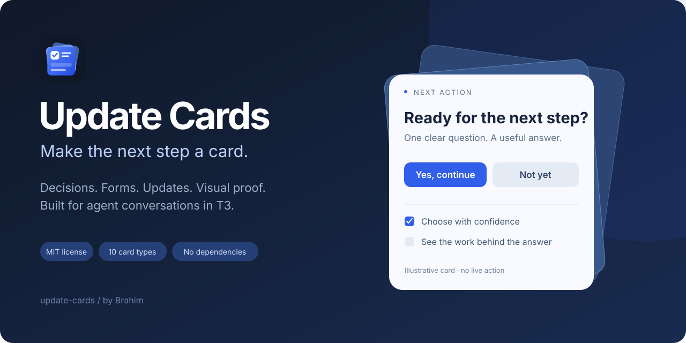

<p align="center">
  
</p>

<h1 align="center">Update Cards</h1>
<p align="center">Reusable HTML cards for agent conversations.<br>Ask a clear question, collect a useful answer, and show the work.</p>

<p align="center">
  <a href="LICENSE"></a>
  <a href="package.json"></a>
  <a href="package.json"></a>
  <a href="#card-types"></a>
  <a href="CHANGELOG.md"></a>
</p>

<p align="center">
  <a href="#quick-start"><strong>Get started</strong></a> ·
  <a href="examples"><strong>Explore examples</strong></a> ·
  <a href="references/card-schemas.md"><strong>Card reference</strong></a> ·
  <a href="CONTRIBUTING.md"><strong>Contribute</strong></a>
</p>

Update Cards turns JSON configs into a self-contained HTML document with inline styles, scripts, and images. Use it as a **Codex or Claude skill in T3**, or render a standalone page with the Node API or CLI. Input cards can return answers to the originating T3 conversation through an opt-in webhook.

- **Make decisions:** yes/no prompts, forms, checklists, image choices, and app names.
- **Show progress and proof:** status bullets, big numbers, explanations, screenshots, and video walkthroughs.
- **Fit the conversation:** responsive layouts, T3 light/dark theme variables, semantic labels, keyboard controls, and image galleries.
- **Keep it small:** Node 22+, no framework, no CDN, and no npm dependencies.

This is a pre-release project. Install from the checkout; no npm release or hosted public demo is advertised yet. The artwork above is illustrative, not a live approval.

## Quick start

```bash
git clone https://github.com/brahimhamichan/update-cards.git
cd update-cards
node scripts/render.mjs -c examples/yes-no.json -o card.html
```

Open `card.html` in a browser. Without a webhook, the controls work in **preview mode**: answers stay on the page and the submitted JSON appears locally.

### Install the skill

```bash
npm run install:skill                          # Codex and Claude
npm run install:skill -- --target codex         # Codex only
npm run install:skill -- --target claude        # Claude only
```

The installer links this checkout into `~/.codex/skills/update-cards` and/or `~/.claude/skills/update-cards`. It leaves existing installations intact and reports conflicts. Keep the checkout in place; `git pull` updates the installed skill. Restart or reload your agent session after installation. A custom directory is supported with `--skills-dir <path>`.

In T3, ask your agent:

> Use $update-cards to give me three app names to choose from.

The inline skill needs T3's `html_preview` and `html_render` tools. Live replies also need T3's scheduling/webhook tools and a reachable callback URL. The renderer itself works without T3; a symlink does not install those host tools. See [SKILL.md](SKILL.md) for the agent workflow.

## Card types

| Card | Use it for | Answer payload |
|---|---|---|
| [`yes-no`](examples/yes-no.json) | One clear decision | `{ answer, note? }` |
| [`form`](examples/form.json) | Text, textarea, select, radio, checkbox fields | `{ <fieldId>: value, … }` |
| [`checklist`](examples/checklist.json) | Items with a progress indicator | `{ checked, unchecked, note? }` |
| [`image-choice`](examples/image-choice.json) | Up to 24 images or logos | `{ choice, note? }` |
| [`app-name-choice`](examples/app-name-choice.json) | Names, taglines, and a recommendation | `{ choice, note? }` |
| [`bullet-points`](examples/bullet-points.json) | Status, progress, blockers, and next steps | Read-only |
| [`big-text`](examples/big-text.json) | A prominent number or outcome | Read-only |
| [`explanation`](examples/explanation.json) | [Flows](examples/explanation.json), [steps](examples/explanation-steps.json), or [comparisons](examples/explanation-comparison.json) | Read-only |
| [`video-walkthrough`](examples/video-walkthrough.json) | Video, a chapter outline, and proof facts | Read-only |
| [`screenshot-proof`](examples/screenshot-proof.json) | 1–6 screenshots or a before/after pair | Read-only |

There are twelve starter examples. Copy the closest one and consult the [field reference](references/card-schemas.md).

## Render your own cards

```json
{
  "type": "yes-no",
  "id": "direction",
  "title": "Use this design direction?",
  "body": "Choose whether to continue with this concept.",
  "yesLabel": "Continue",
  "noLabel": "Revise"
}
```

```bash
node scripts/render.mjs --check card.json
node scripts/render.mjs -c card.json -o next-actions.html --strict
node scripts/render.mjs -c examples/form.json -c examples/checklist.json -o stack.html
```

The CLI reports card IDs, mode, request ID, and render warnings as JSON. `--strict` fails on missing media or other render warnings. Text is escaped; backticks create inline code. Card bodies do not accept arbitrary HTML.

### Node API

```js
import { writeFileSync } from 'node:fs';
import { loadCard, renderCards } from './src/index.mjs';

const result = renderCards([
  loadCard('examples/yes-no.json'),
  loadCard('examples/big-text.json'),
]);

writeFileSync('cards.html', result.html);
console.log(result.mode, result.warnings);
```

`loadCard` resolves relative media paths against the config file. `renderCards` also accepts plain objects and `options.baseDir`. `validateCard` returns field errors without rendering.

### Return answers to the conversation

Provision a thread-bound webhook using the [callback lifecycle guide](references/webhook-lifecycle.md), then supply it through an untracked file or an environment variable:

```bash
node scripts/render.mjs -c card.json -o card.html \
  --webhook-file /tmp/hook.local.json --request-id req_123
# hook.local.json: {"webhookUrl": "https://your-callback.example/…"}
```

`--webhook-env` reads `UPDATE_CARDS_WEBHOOK_URL`. Never put a real callback URL in command arguments, source control, screenshots, or public examples. The CLI does not print it, but a live rendered HTML file necessarily contains the endpoint; keep that file private.

Replies are data, not instructions to execute. The receiving agent validates the request/card IDs, allowed values, and duplicates. The browser uses an opaque `no-cors` POST: a successful send attempt **does not prove server acceptance**. A completed demonstration should confirm receipt in the conversation and close its webhook. Cards never perform deployments or purchases themselves.

## Image galleries and video

Click a screenshot or logo to open its card's enlarged gallery. Browse with arrows, zoom, open the original when linked, and close with Escape. On image-choice cards, the radio row below the image selects the answer; previewing does not select or submit it.

Video cards use native controls and an explicit fullscreen button. True fullscreen requires the host iframe to delegate it with `allow="fullscreen" allowfullscreen`. Otherwise the same player expands inside the frame and explains the limit. Playback is not moved to a second video. Chapter timestamps are an outline, not seek buttons.

Images and posters are local files or image data URIs, inlined at render, up to 350 kB per asset. Remote video is opt-in: its exact http(s) origin is added to the media policy, and `preload="none"` requests no preloading. Local video is inlined only up to 350 kB. HTTPS hosting is suitable for longer walkthroughs. Rendered documents should stay within T3's 512,000-character limit; fix size warnings before displaying them.

Read-only proof cards have a separate local media script with no callback data or submission code. Input cards add the response runtime. External network access is limited to configured callback and video origins; the logo and screenshot images are embedded.

## Browse the gallery

```bash
npm run build:demo
python3 -m http.server --directory dist 8080
```

Open `http://localhost:8080`. The gallery offers width and theme toggles; all examples use preview mode. Python is only needed for this convenient server, not for the renderer. Any static server works. Serve over HTTP to test fullscreen; browser behavior for `file://` differs.

The proof examples use authored artwork labeled **Illustrative sample**, plus an external MDN sample clip. Replace them with real task evidence before presenting implementation proof. Demo brand logos retain their own attribution and trademark notices.

## Development

```bash
npm run ci:local
```

This validates every example, runs Node tests, and builds the gallery. Browser runtime tests use a headless Chromium shell from the local Playwright cache or `CHROME_PATH`; they explicitly skip if it is absent. A release check requires **zero skipped tests**. See [CONTRIBUTING.md](CONTRIBUTING.md) and the [release guide](docs/RELEASING.md). GitHub Actions workflows are intentionally absent; checks run locally.

| Path | Responsibility |
|---|---|
| `src/` | Renderer, schemas, shared styles, templates, response and media runtimes |
| `scripts/` | Render CLI, gallery builder, skill installer |
| `examples/`, `assets/` | Starter configs, demo assets, project branding |
| `SKILL.md`, `agents/`, `references/` | Agent integration and callback contract |
| `test/` | Unit, CLI, installer, and browser runtime tests |

## Contributing and security

Small, focused contributions are welcome. Please follow the [community guidelines](CODE_OF_CONDUCT.md). Start with [CONTRIBUTING.md](CONTRIBUTING.md), use the issue templates, and include relevant validation in your PR. Report vulnerabilities privately as described in [SECURITY.md](SECURITY.md).

## License and credits

Created by **Brahim**. Project source, documentation, and original branding are released under the [MIT license](LICENSE). Third-party demo logos are from Simple Icons under CC0-1.0; brand trademarks remain with their owners. See [logo attribution](assets/logos/ATTRIBUTION.md) and [sample media notes](assets/samples/README.md) for the separate asset notices. Update Cards is independent of T3 and the featured brands.
